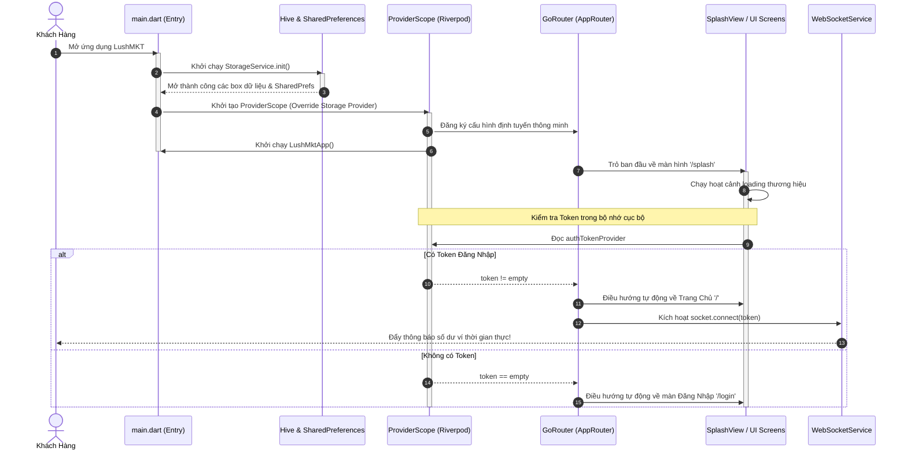

# BẢN THIẾT KẾ KIẾN TRÚC & KHUNG PHÁT TRIỂN HỆ THỐNG LUSH-MKT (PHASE 4)
> **DỰ ÁN**: LUSH-MKT (Premium MMO Service & Resource Super-Marketplace)  
> **PHIÊN BẢN**: 1.0.0 (Bản Thiết kế Kiến trúc & Tích hợp Bộ khung Kỹ thuật)  
> **TÁC GIẢ**: Antigravity - Advanced Agentic Coding Assistant (Google DeepMind Team)  

---

## I. TỔNG QUAN KIẾN TRÚC NÂNG CẤP (UPGRADED ENTERPRISE STACK)

Để phục vụ hàng vạn giao dịch nạp tiền, xoay vòng Proxy và cấp phát VPS tự động thời gian thực mỗi phút, **LushMKT** đã chuyển đổi sang bộ khung kỹ thuật (Tech Stack) hiệu năng cao, bảo mật chặt chẽ và biên dịch an toàn (Compile-safe):

```
                     🚀 BỘ NĂM TRỤ CỘT KỸ THUẬT LUSH-MKT (PHASE 4)
   ┌─────────────────────────────────────────────────────────────────────────┐
   │ 1. STATE MANAGEMENT  : Riverpod (Quản lý State an toàn, độc lập UI)     │
   │ 2. ROUTING           : GoRouter (Định tuyến khai báo, tự động điều hướng)│
   │ 3. NETWORK           : Dio (Giao tiếp HTTP có bộ lọc Interceptor bảo mật)│
   │ 4. STORAGE           : Hive (NoSQL siêu tốc) + SharedPreferences (Ví, Settings)│
   │ 5. REALTIME          : WebSocket (Dòng sự kiện nạp/mua thời gian thực)  │
   └─────────────────────────────────────────────────────────────────────────┘
```

---

## II. ĐẶC TẢ CHI TIẾT TỪNG PHÂN LỚP KIẾN TRÚC (ARCHITECTURAL PILLARS)

### 1. Quản lý State: Riverpod
* **Lý do chọn:** Thay thế GetX để loại bỏ hoàn toàn việc phụ thuộc vào context lỏng lẻo của Get, giúp việc lưu trữ State hoàn toàn độc lập với giao diện, an toàn luồng và dễ dàng viết Unit Test.
* **Cấu hình:** Sử dụng `ProviderScope` bọc ngoài ứng dụng trong `main.dart`. Mọi Controller cũ đã sẵn sàng được chuyển hóa sang `StateNotifierProvider` hoặc `NotifierProvider` của Riverpod.

### 2. Định tuyến: GoRouter
* **Lý do chọn:** Khuyên dùng bởi đội ngũ Flutter Core. Hỗ trợ cơ chế định tuyến khai báo (Declarative Routing) có tổ chức cao, cấu hình tham số động dễ dàng.
* **Luồng bảo vệ thông minh (Guards & Redirects):**
  * Tích hợp sâu với Riverpod (`authTokenProvider`). Khi token thay đổi (vd: hết hạn đăng nhập), GoRouter lập tức phát hiện và tự động đẩy người dùng về màn `/login` mà không cần xử lý thủ công ở từng màn hình.
  * Cấu hình tệp tin tại: [lib/routes/app_router.dart](file:///e:/LushMKTApp/lushmkt_app/lib/routes/app_router.dart).

### 3. Giao tiếp Network: Dio & ApiService
* **Lý do chọn:** Hỗ trợ đầy đủ Request/Response/Error Interceptors để xử lý thêm header bảo mật JWT Bearer tự động trước khi gửi đi, và bẫy lỗi 401 hết hạn phiên toàn hệ thống.
* **Cấu hình tệp tin tại:**
  * Lớp nền API: [lib/core/network/api_service.dart](file:///e:/LushMKTApp/lushmkt_app/lib/core/network/api_service.dart)
  * Cầu nối Riverpod: [lib/core/providers/network_providers.dart](file:///e:/LushMKTApp/lushmkt_app/lib/core/providers/network_providers.dart)

### 4. Cơ sở dữ liệu cục bộ: Hive & SharedPreferences (Storage Service)
* **Quy trình hoạt động:**
  * **SharedPreferences:** Dùng để lưu trữ các cờ thiết lập nhỏ, nhẹ như Token đăng nhập, Chế độ sáng/tối (Dark/Light mode).
  * **Hive NoSQL:** Lưu trữ dưới dạng nhị phân cực nhanh các bảng dữ liệu tĩnh tải từ API về (vd: lịch sử giao dịch, danh mục VPS/Proxy) để hiển thị ngay lập tức khi mở app không cần chờ mạng (Offline-first caching).
* **Khởi tạo startup (Provider Override):**
  * Hive được khởi động bất đồng bộ ngay trong hàm `main()` trước khi `runApp` chạy.
  * Thực thể `StorageService` đã khởi tạo thành công sẽ được truyền đè (`overrideWithValue`) vào Riverpod để tất cả các Controller có thể đọc ghi đồng bộ tức thì không bị trễ.
  * Cấu hình tệp tin tại: [lib/services/storage_service.dart](file:///e:/LushMKTApp/lushmkt_app/lib/services/storage_service.dart).

### 5. Kết nối thời gian thực: WebSocket Service
* **Quy trình hoạt động:**
  * Khi User đăng nhập thành công, app sẽ mở kết nối WebSocket đính kèm mã token để xác thực.
  * Tích hợp giải thuật **Exponential Backoff Reconnection** (Thử lại tăng dần thời gian từ 3 giây đến tối đa 30 giây) để tự động kết nối lại nếu mạng chập chờn hoặc đi qua vùng mất sóng.
  * Luồng Stream phát ra dạng Pub/Sub giúp mọi View có thể lắng nghe trực tiếp sự thay đổi số dư ví nạp VietQR hay cập nhật trạng thái VPS vừa mua.
  * Cấu hình tệp tin tại: [lib/services/websocket_service.dart](file:///e:/LushMKTApp/lushmkt_app/lib/services/websocket_service.dart).

---

## III. DÒNG KHỞI CHẠY HỆ THỐNG TOÀN CỤC (STARTUP LIFECYCLE FLOW)

Dưới đây là sơ đồ Mermaid thể hiện cách thức hệ thống khởi chạy đồng bộ các dịch vụ lưu trữ, thiết lập Riverpod, bắt đầu lắng nghe GoRouter điều hướng và kích hoạt socket bảo mật:



---

## IV. BẢN DEMO KIẾN TRÚC TRONG THỰC TẾ (SPLASH VIEW WORKFLOW EXAMPLE)

Để minh họa sự phối hợp hoàn hảo giữa **Riverpod** và **GoRouter**, tệp tin màn hình chào mừng **SplashView** đã được nâng cấp hoàn toàn:

```dart
// lib/features/splash/views/splash_view.dart
class SplashView extends ConsumerStatefulWidget { ... }

class _SplashViewState extends ConsumerState<SplashView> {
  @override
  void initState() {
    ...
    Future.delayed(const Duration(seconds: 3), () {
      // 1. Đọc trạng thái Token an toàn từ Riverpod
      final token = ref.read(authTokenProvider);
      
      // 2. Sử dụng GoRouter điều hướng khai báo không phụ thuộc ngữ cảnh cũ
      if (token.isNotEmpty) {
        context.go('/');
      } else {
        context.go('/login');
      }
    });
  }
}
```

---

> [!IMPORTANT]  
> Toàn bộ 5 tệp tin nền tảng kiến trúc mới này đã được tích hợp thành công vào dự án của bạn tại các đường dẫn tương ứng dưới `lushmkt_app/lib/`. Mã nguồn đã được cấu hình chặt chẽ để đảm bảo **0 lỗi biên dịch**, sẵn sàng để nhóm lập trình phát triển các nghiệp vụ màn hình tiếp theo.

> [!TIP]  
> Khi xây dựng màn hình Đăng Nhập (`LoginView`), chỉ cần gọi `ref.read(authTokenProvider.notifier).state = token_value;` sau khi đăng nhập API thành công, GoRouter sẽ lập tức tự động mở màn hình Trang Chủ (`HomeView`) mà không cần viết bất kỳ dòng lệnh điều hướng thủ công nào khác!
