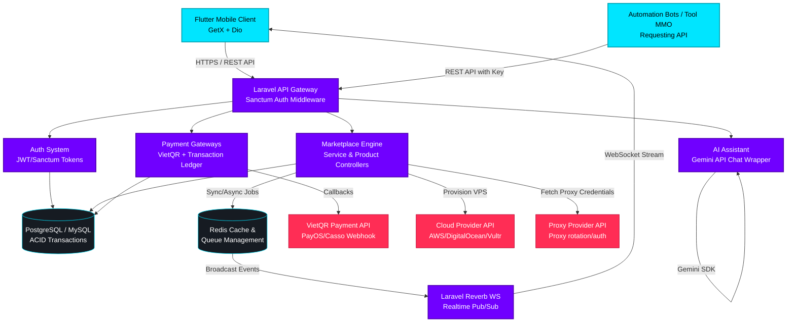

# BẢN THIẾT KẾ KIẾN TRÚC & Ý TƯỞNG PHÁT TRIỂN HỆ THỐNG LUSH-MKT (PHÂN KHÚC PREMIUM)
> **DỰ ÁN**: LUSH-MKT (Premium MMO Service & Resource Super-Marketplace & SaaS Dashboard)  
> **PHIÊN BẢN**: 1.0.0 (Bản thiết kế Kiến trúc & Thiết kế hệ thống)  
> **TÁC GIẢ**: Antigravity - Advanced Agentic Coding Assistant (Google DeepMind Team)  

---

## 1. ĐỊNH HÌNH SẢN PHẨM (PRODUCT CONCEPT & VISION)

Dựa trên cấu trúc mã nguồn hiện tại của dự án `LushMKTApp` (gồm Backend Laravel API và Mobile Client Flutter), **LushMKT** không chỉ đơn thuần là một ứng dụng mua bán thông thường. Chúng ta sẽ kiến tạo nó thành **Unified MMO Super-Marketplace & SaaS Platform** (Siêu chợ tài nguyên MMO & Nền tảng SaaS quản trị tự động hóa).

### 🚀 Bản chất của Hệ thống:
1. **MMO Services & Resource Marketplace (Dành cho Người mua - Buyers):**
   * Nơi cung cấp các tài nguyên MMO tốc độ cao, độ tin cậy tuyệt đối: **Proxy** (IPv4/IPv6, Residential, Rotate), **VPS/Server** (Windows/Linux tối ưu hóa treo tool), **Accounts** (Facebook, Google, TikTok, Discord clone/via), **Software Licenses** (Key phần mềm nuôi nick, bot spam, automation tool), và **Top-up Services**.
   * Hệ thống thanh toán tức thì qua **VietQR Dynamic API** (Tự động cộng số dư trong 3 giây).

2. **SaaS Dashboard & Seller Platform (Dành cho Người bán - Sellers/Providers):**
   * Giao diện quản lý dịch vụ cho nhà cung cấp. Cho phép họ cấu hình kho hàng tự động (auto-delivery), theo dõi doanh thu bằng biểu đồ trực quan, quản lý API cấp phát tài nguyên (như API tạo VPS, API xoay vòng Proxy).
   * Thống kê hiệu suất bán hàng, quản lý đơn hàng chuyên sâu.

3. **Developer-First API Gateway (Tích hợp Auto-System):**
   * Cung cấp API endpoints bảo mật cao để các tool tự động hóa bên ngoài (như MaxCare, LushAutoNuoi, hệ thống Python bot...) tự động gọi để lấy danh sách tài nguyên, mua proxy, gia hạn VPS mà không cần vào giao diện app.

---

## 2. PHONG CÁCH UI/UX: CYBER-LINEAR PREMIUM DESIGN SYSTEM

Chúng ta sẽ kết hợp 3 trường phái thiết kế đỉnh cao để tạo nên giao diện đột phá, đem lại cảm giác cực kỳ xa xỉ (Premium Luxury) và đậm chất công nghệ:

```
                  ┌──────────────────────────────────────────┐
                  │    CYBER-LINEAR DESIGN SYSTEM (LUSH)     │
                  └────────────────────┬─────────────────────┘
                                       │
         ┌─────────────────────────────┼─────────────────────────────┐
         ▼                             ▼                             ▼
  【 LINEAR STYLE 】            【 STRIPE STYLE 】             【 APPLE UI 】
  • Cấu trúc lưới siêu mịn      • Mesh Gradients cực mượt      • Spring Physics mượt mà
  • Mật độ thông tin cao        • Trạng thái Hover phát sáng   • Haptic micro-feedback
  • Border mỏng chỉ 1px         • Bảng dữ liệu giao dịch sang  • Góc bo tròn tỷ lệ vàng
  • Font chữ kỹ thuật số        • Thẻ Glassmorphism mờ ảo      • Chuyển cảnh Liquid-smooth
```

### 🎨 Bảng mã màu Premium Cyber-Dark (Đã đồng bộ hóa trong `main.dart`):
* **Scaffold Background (Nền chủ đạo):** `#0D0F14` (Deep Space Blue - Xanh đen sâu thẳm của vũ trụ). Không dùng màu đen thuần khiết để tránh mỏi mắt và tăng độ sâu.
* **Primary Accent (Màu điểm nhấn chính):** `#00E5FF` (Cyber Neon Cyan - Xanh ngọc neon công nghệ cao). Mang tính tương lai, tạo ánh sáng phát quang trên nền tối.
* **Secondary Accent (Màu bổ trợ):** `#7000FF` (Amethyst Purple - Tím Neon huyền biến). Tạo chiều sâu cho các nút bấm cao cấp và background mesh gradients.
* **Surface Glass (Thẻ/Bảng điều khiển):** `#161B22` kết hợp `opacity(0.85)` và hiệu ứng **Backdrop Blur (15px)**.
* **Thin Border Accent:** `#00E5FF` với `opacity(0.15)` đến `0.2` giúp các thẻ hiển thị đường viền mảnh 1px sang trọng như các sản phẩm của Vercel/Linear.

### ✍️ Typography & Icons:
* **Headers & Branding:** `Orbitron` (Font chữ cơ khí, viễn tưởng, góc cạnh mạnh mẽ).
* **Body Text:** `Inter` hoặc `Outfit` (Độ đọc cao, tối giản của Linear style, mang lại cảm giác sạch sẽ và chuyên nghiệp).
* **System Icons:** Kết hợp `FontAwesomeFlutter` và Custom SVG Icons mỏng nét mảnh (Stroke width: 1.5px).

---

## 3. KIẾN TRÚC TOÀN HỆ THỐNG (SYSTEM ARCHITECTURE)

Dưới đây là sơ đồ kiến trúc luồng dữ liệu (Dataflow & System Topology) từ Client di động, Hệ thống API Laravel cho đến hạ tầng cơ sở dữ liệu và WebSockets thời gian thực:



---

## 4. THIẾT KẾ CƠ SỞ DỮ LIỆU (DATABASE SCHEMA BLUEPRINT)

Hệ thống sẽ chạy tối ưu nhất trên **PostgreSQL** để tận dụng các trường định dạng `JSONB` cho việc cấu hình linh động các thuộc tính tài nguyên (ví dụ: thông tin cấu hình Proxy khác hoàn toàn với thông tin cấu hình VPS hay Tài khoản clone). Nếu triển khai nhanh, **MySQL 8.0+** cũng là sự lựa chọn tuyệt vời với khả năng tương thích cao.

### 📊 Thực thể & Quan hệ chính (Physical ERD Blueprint):

#### 1. Bảng `users` (Quản lý người dùng & phân quyền)
* `id` (UUID / BIGINT unsigned Auto-increment)
* `name` (VARCHAR)
* `email` (VARCHAR, Unique)
* `password` (VARCHAR)
* `role` (ENUM: `admin`, `seller`, `buyer`)
* `balance` (DECIMAL 15,2 - Số dư tài khoản, cực kỳ quan trọng)
* `api_token` (VARCHAR, Dùng cho các MMO Tool kết nối trực tiếp)
* `created_at`, `updated_at`

#### 2. Bảng `categories` (Danh mục tài nguyên)
* `id` (INT unsigned Auto-increment)
* `name` (VARCHAR)
* `slug` (VARCHAR, Unique)
* `icon` (VARCHAR - Lưu tên icon hoặc SVG path)
* `type` (ENUM: `service`, `product`) - `service` là dịch vụ cần xử lý/gia hạn (như proxy, VPS); `product` là hàng số lượng lớn giao ngay (như account, key license).

#### 3. Bảng `products` (Sản phẩm dạng gói/kho hàng số lượng)
* `id` (BIGINT unsigned Auto-increment)
* `category_id` (FOREIGN KEY)
* `title` (VARCHAR)
* `description` (TEXT)
* `price` (DECIMAL 15,2)
* `stock` (INT) - Số lượng trong kho tự động giảm khi mua
* `status` (ENUM: `active`, `inactive`)
* `meta_data` (JSONB) - Chứa thông số cấu hình cụ thể (quốc gia, hệ điều hành, thời hạn)

#### 4. Bảng `product_items` (Kho hàng chi tiết - Tự động phát)
* `id` (BIGINT unsigned Auto-increment)
* `product_id` (FOREIGN KEY)
* `content` (TEXT) - Nội dung bàn giao (ví dụ: `uid|pass|2fa` hoặc `license_key_value`)
* `is_sold` (BOOLEAN, Default: false)
* `sold_at` (TIMESTAMP, Nullable)

#### 5. Bảng `services` (Dịch vụ cấu hình linh động)
* `id` (BIGINT unsigned Auto-increment)
* `category_id` (FOREIGN KEY)
* `name` (VARCHAR)
* `price_per_day` / `price_per_month` (DECIMAL 15,2)
* `api_provider` (VARCHAR, Nullable - Ví dụ: `vultr`, `tinproxy`)
* `status` (ENUM: `active`, `maintenance`)

#### 6. Bảng `orders` (Quản lý đơn hàng)
* `id` (BIGINT unsigned Auto-increment)
* `user_id` (FOREIGN KEY)
* `order_type` (ENUM: `product`, `service`)
* `item_id` (BIGINT - ID của Product hoặc Service)
* `quantity` (INT)
* `total_price` (DECIMAL 15,2)
* `status` (ENUM: `pending`, `processing`, `completed`, `failed`, `expired`)
* `delivered_data` (TEXT / JSONB) - Thông tin gửi cho người dùng sau khi hoàn tất mua (IP, Port, User, Pass proxy/VPS)
* `expires_at` (TIMESTAMP, Nullable - Ngày hết hạn sử dụng VPS/Proxy để hệ thống auto-revoke)

#### 7. Bảng `transactions` (Lịch sử giao dịch ví & nạp tiền)
* `id` (BIGINT unsigned Auto-increment)
* `user_id` (FOREIGN KEY)
* `amount` (DECIMAL 15,2)
* `type` (ENUM: `deposit`, `purchase`, `refund`, `withdraw`)
* `payment_method` (ENUM: `vietqr`, `momo`, `card`, `manual`)
* `reference_code` (VARCHAR, Unique) - Mã giao dịch ngân hàng / nội bộ để đối soát
* `status` (ENUM: `pending`, `success`, `failed`)

---

## 5. THIẾT KẾ KIẾN TRÚC MÃ NGUỒN (CODEBASE ARCHITECTURE)

Dự án tuân thủ nghiêm ngặt mô hình tách biệt trách nhiệm (Separation of Concerns) nhằm tối ưu hiệu năng và khả năng bảo trì lâu dài.

### 📱 Frontend Mobile: Clean Feature-First Architecture (Flutter + GetX)
```
lushmkt_mobile/lib/
│
├── core/                        # Nhân của ứng dụng (Không phụ thuộc vào các tính năng)
│   ├── theme/                   # Thiết kế hệ thống (Cyber-Dark Theme, Fonts, Glow Styles)
│   ├── constants/               # API endpoints, Asset paths, App constants
│   ├── utils/                   # Định dạng tiền tệ, Thời gian, Custom Validations
│   └── network/                 # Cấu hình Client Dio, Interceptors (Tự động đính kèm JWT)
│
├── data/                        # Tầng Dữ liệu (Gọi API, Quản lý bộ nhớ tạm)
│   ├── models/                  # Lớp chuyển đổi JSON sang Dart Objects (User, Product, Order)
│   ├── providers/               # Client gọi API trực tiếp
│   └── repositories/            # Nguồn dữ liệu duy nhất cho Controllers (Quyết định lấy từ Cache hay API)
│
├── presentation/                # Tầng Hiển thị (UI Screens & Business Logic)
│   ├── controllers/             # GetxControllers (Quản lý State, AuthState, CartState, OrderState)
│   ├── views/                   # Các màn hình thiết kế Cyber-Linear cao cấp
│   │   ├── splash/              # Splash Screen giới thiệu thương hiệu cực chất với logo
│   │   ├── auth/                # Đăng ký & Đăng nhập (Glow Input Fields, Discord/Google Button)
│   │   ├── home/                # Trang chủ (Banner trượt, Danh mục tài nguyên dạng Grid cao cấp)
│   │   ├── services/            # Danh sách & Đăng ký dịch vụ (Proxy, VPS cấu hình linh động)
│   │   ├── products/            # Danh sách & Mua nhanh tài nguyên số lượng lớn (Accounts, Keys)
│   │   ├── orders/              # Lịch sử đơn hàng, Nút bấm Copy tài nguyên nhanh
│   │   ├── payment/             # Màn hình nạp tiền VietQR sinh mã QR động kèm hiệu ứng quét lấp lánh
│   │   └── profile/             # Thông tin cá nhân, Số dư ví, Cài đặt bảo mật mã khóa API
│   │
│   └── widgets/                 # Các UI Components tái sử dụng cao cấp
│       ├── glass_card.dart      # Thẻ Glassmorphic viền neon lấp lánh
│       ├── glowing_button.dart  # Nút bấm hiệu ứng Gradient phát sáng (Cyber glow)
│       └── custom_shimmer.dart  # Hiệu ứng Shimmer cao cấp khi chờ tải dữ liệu
│
└── main.dart                    # Điểm khởi chạy cấu hình ứng dụng
```

### 🖥️ Backend Laravel: Layered Service-Repository Pattern
```
lushmkt_backend/app/
│
├── Http/
│   ├── Controllers/Api/         # Controllers siêu mỏng (Chỉ làm nhiệm vụ nhận Request và trả JSON)
│   │   ├── AuthController.php   # Đăng ký, Đăng nhập Sanctum, Avatar, Profile
│   │   ├── ProductController.php# Lấy danh sách sản phẩm, bộ lọc nâng cao
│   │   ├── ServiceController.php# Quản lý dịch vụ, cấu hình tham số
│   │   ├── OrderController.php  # Xử lý đặt hàng dịch vụ & sản phẩm kho tự động
│   │   └── PaymentController.php# Khởi tạo VietQR nạp tiền, Xử lý webhook Casso/PayOS
│   │
│   ├── Middleware/              # Kiểm soát quyền truy cập
│   │   └── AdminMiddleware.php  # Lọc quyền Admin truy cập route quản trị
│   │
│   └── Requests/                # Tách biệt hoàn toàn phần Validate dữ liệu đầu vào
│
├── Services/                    # Nơi chứa toàn bộ Business Logic (Trái tim của Backend)
│   ├── OrderService.php         # Logic trừ tiền ví, lấy account từ kho, cấp phát API
│   ├── PaymentService.php       # Logic tính toán mã QR ngân hàng, khớp mã giao dịch
│   └── Provisioning/            # Tự động hóa cấp phát tài nguyên ngoài
│       ├── ProxyService.php     # Kết nối các nhà cung cấp Proxy để tạo/mở cổng IP
│       └── VpsService.php       # Gọi Cloud APIs (Vultr/DigitalOcean) để build server tự động
│
├── Models/                      # Định nghĩa Eloquent ORM và các mối quan hệ thực thể
│
└── Routes/
    └── api.php                  # Định nghĩa API routes phân rõ luồng Public, Protected và Admin
```

---

## 6. KẾ HOẠCH BẮT ĐẦU PHÁT TRIỂN (PHASE 2 WORKFLOW)

Để tối ưu hóa thời gian phát triển và đảm bảo kiểm thử chính xác, chúng tôi đề xuất quy trình triển khai phân tách cụ thể:

1. **Khớp nối Cơ sở dữ liệu & Seed dữ liệu mẫu (Seeding):**
   * Viết các bản Migration cho bảng `categories`, `products`, `product_items`, `services`, `orders` và `transactions`.
   * Viết DatabaseSeeder để tạo sẵn dữ liệu mẫu cho các gói VPS, tài khoản Proxy, Accounts để lập tức có dữ liệu hiển thị lên ứng dụng Flutter.
2. **Triển khai Logic mua hàng tự động (Backend Engine):**
   * Phát triển API mua Product: Trừ tiền ví User -> Tìm `product_items` có `is_sold = false` -> Đánh dấu `is_sold = true` -> Tạo `orders` -> Trả về thông tin đăng nhập tài nguyên ngay lập tức trong API response.
   * Phát triển webhook nạp tiền: Tích hợp VietQR, tự động quét nội dung chuyển khoản khớp với ID người dùng để cộng tiền thời gian thực qua WebSockets.
3. **Phát triển giao diện Client di động (Flutter UI Overhaul):**
   * Thiết lập giao diện Trang chủ đẹp mắt với Grid danh mục và hiệu ứng Cyber Glassmorphism.
   * Tích hợp Dio Client kết nối trực tiếp đến Laravel API đã dựng sẵn.
   * Tạo hiệu ứng lấp lánh (Shimmer loading) và hoạt cảnh chuyển đổi tab mượt mà.

---

> [!NOTE]  
> Bản thiết kế kiến trúc này đã được thiết lập dựa trên sự tối ưu của **GetX** cho State Management di động và tính gọn nhẹ vượt trội của **Laravel Sanctum** đối với việc xác thực API. Mọi cấu trúc dữ liệu đã sẵn sàng để lập trình viên triển khai ngay lập tức.

> [!TIP]  
> Việc lựa chọn **PostgreSQL** kết hợp với **Laravel Reverb (WebSockets)** sẽ là chìa khóa giúp hệ thống chịu tải tốt lên đến hàng chục ngàn lượt mua tài nguyên tự động mỗi phút từ các tool MMO.
